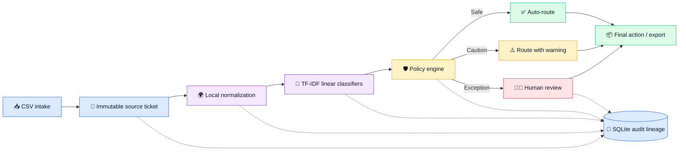

<div align="center">

# 🔷 AI Workflow Control Plane

### No-API MVP · UX-First Multilingual Support Operations

[](https://www.python.org/)
[](https://streamlit.io/)
[](https://scikit-learn.org/)
[](#-data-and-privacy)
[](LICENSE)

**A local-first support operations tool for triaging multilingual tickets without handing control to a black-box model.**

Upload support tickets, compare original messages with locally normalized English text, receive routing recommendations with confidence and policy checks, and review or override any decision before it becomes final.

</div>

---

## 💙 Why it feels different

> This is not just a classifier demo. The experience is built around trust: what the user sees, how clearly the system explains itself, and when a human stays in control.

The workflow is intentionally simple:

```text
Ingest → Normalize → Predict → Safeguard → Review → Trace
```

### Two-mode navigation

- **Setup Mode** is a required three-step path for each new dataset: **Load Data → Normalize and Predict → Confirm Policy Settings**. Completed steps show a checkmark, backward navigation remains available, and unfinished forward steps stay locked.
- **Operations Mode** is an always-open daily console with four task tabs: **Inbox**, **Needs Your Review**, **What Happened**, and **Performance**. Ticket context follows the user between relevant tabs.
- **Admin & Setup** visually separates dataset controls, flagging rules, settings, exports, and portfolio material from frontline review work.
- Navigation remains open during daily operations; only irreversible actions such as finalizing an incomplete review or exporting unsafe text are blocked, with a specific inline reason.

- **Original text stays immutable.** Normalized English is stored as a separate, inspectable layer.
- **Recommendations are never silent.** Queue, priority, type, confidence, and model signals remain visible.
- **Policy sits between prediction and action.** Confidence, language, tags, keywords, and priority can stop automation.
- **Humans keep the final say.** Reviewers can approve, reject, reroute, and document overrides.

---

## 💚 What the user can do

| Step | Experience | Outcome |
|---:|---|---|
| **1** | 📥 Upload a dataset and inspect schema, field coverage, and language distribution | Know whether the data is usable before processing |
| **2** | 🌍 Compare original text with the English-normalized representation | Verify meaning instead of hiding language handling |
| **3** | 🧠 Review predicted queue, priority, and issue type with confidence | Understand the recommendation, not just the output |
| **4** | 🛡️ Inspect every triggered policy rule | See why a ticket was routed, warned, or escalated |
| **5** | 👩‍💼 Work through an urgency-sorted human review queue | Approve or reroute exceptions and capture notes |
| **6** | 🔎 Open the audit timeline for any ticket | Trace intake, normalization, prediction, policy, and review |

---

## 🟡 What is implemented

### Data and language handling

- CSV upload, inferred column mapping, quality checks, normalization, and a bundled sample dataset
- Compatibility with the Kaggle-style ticket schema: queue, priority, language, subject, body, type, business type, and split tag fields
- Immutable source text plus a separate `normalizations` record for every processed ticket
- Offline English/German normalization with explicit method, confidence, fallback, and status fields
- Lightweight local language detection when the input language is missing
- Safe preservation and forced review for unsupported or failed language handling

### Local machine learning

- TF-IDF text features built from normalized text, tags, and source language
- Probabilistic linear classifiers for queue, priority, and ticket type
- Per-field confidence scores and strongest normalized-text signals
- Deterministic 20% holdout evaluation so displayed accuracy is measured on unseen tickets
- No OpenAI, Gemini, hosted translation service, or paid model dependency

### Governance and operations

- Configurable confidence thresholds, risk keywords, restricted tags, and language safeguards
- Three governed outcomes: **auto-route**, **auto-route with warning**, and **human review**
- Reviewer queue with approve, reject, reroute, final-field overrides, and notes
- Full SQLite lineage across source input, normalization, prediction, policy, reviewer action, and timestamps
- Analytics for holdout accuracy, review and override rates, policy hits, language mix, translation coverage, failures, and handling time
- CSV handoff and optional Jira-ready payload simulation

---

## 🩷 Honest product framing

> [!IMPORTANT]
> This is a product-style MVP, not a production enterprise platform.

The models are intentionally simple, multilingual support is deliberately narrow, and the normalization layer favors transparency over best-in-class translation quality. That tradeoff is the point: the project demonstrates where automation should help, where it should stop, and how the user remains in control.

For German tickets, the MVP uses a transparent support-domain lexicon plus tag metadata and marks the result as `normalized_with_fallback`. Unsupported or failed language handling is preserved verbatim and forced into review.

---

## 🩵 Architecture



| Layer | Responsibility |
|---|---|
| **Presentation** | Streamlit screens for intake, exploration, predictions, policies, review, audit, analytics, and export |
| **Application** | Control-plane orchestration for normalization, classification, policy evaluation, reviewer workflow, and analytics |
| **Data** | SQLite tables for tickets, normalizations, predictions, decisions, rules, reviews, configuration, and audit events |

### Project structure

```text
.
├── app.py                         # Streamlit presentation layer
├── data/
│   └── sample_tickets.csv         # Synthetic credential-free demo data
├── src/control_plane/
│   ├── classifier.py              # Local TF-IDF linear models
│   ├── normalizer.py              # Offline language handling
│   ├── policy.py                  # Post-prediction safeguards
│   ├── service.py                 # Workflow orchestration
│   ├── db.py                      # SQLite persistence and lineage
│   ├── data.py                    # CSV mapping and validation
│   └── config.py                  # Persistent product settings
└── tests/
    └── test_control_plane.py      # Workflow and policy tests
```

---

## 💚 Run locally

Python 3.11 or newer is recommended.

```powershell
python -m venv .venv
.venv\Scripts\Activate.ps1
pip install -r requirements.txt
streamlit run app.py
```

Then:

1. Open **Dataset Ingestion**.
2. Save the provided multilingual dataset or bundled sample.
3. Open **Model Predictions** and score the batch.
4. Inspect policy outcomes and resolve exceptions in **Human Review Queue**.
5. Trace a completed decision in **Audit Trail**.

### Run tests

```powershell
pip install -r requirements-dev.txt
$env:PYTHONPATH = "src"
pytest -q
```

---

## 💜 Data and privacy

- Bundled sample records are synthetic.
- Runtime state stays local in `data/control_plane.db` and is excluded from Git.
- The MVP requires no external API keys or hosted translation services.
- The full multilingual dataset is not committed to this repository; upload it through the app or place it in your local Downloads folder using the expected filename.
- The supported source is Tobias Bueck's [Customer IT Support - Ticket Dataset](https://www.kaggle.com/datasets/tobiasbueck/multilingual-customer-support-tickets), licensed under CC BY 4.0.

> [!NOTE]
> Unsupported languages and failed normalization never discard or rewrite the source ticket. The original content remains available and policy forces the ticket into human review.

---

## 🌹Idea angle

This project is strongest when presented as a **workflow-governance product**, not a translation or classification demo.

Its core signal is the integration of:

- multilingual intake,
- local and explainable AI assistance,
- explicit policy enforcement,
- human reviewer control, and
- end-to-end auditability

in one coherent user flow.

<div align="center">

**AI recommends · Policy governs · Humans retain control**

</div>

---

## License

Released under the [MIT License](LICENSE).
